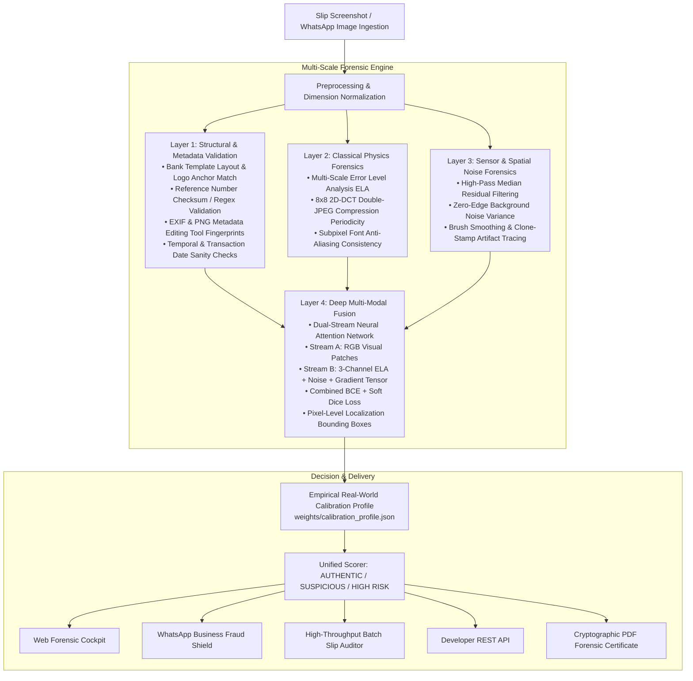

# VeriSlip — AI Forensic Detection Platform for Payment Slips & Invoices

[](https://github.com/chirana07/VeriSlip/actions)
[](https://www.python.org/downloads/)
[](https://pytorch.org/)
[](https://fastapi.tiangolo.com/)
[](https://github.com/chirana07/VeriSlip/actions)
[](https://opensource.org/licenses/MIT)
[](https://github.com/chirana07/VeriSlip/issues)
[](https://github.com/chirana07/VeriSlip/pulls)

**VeriSlip** is an enterprise-grade, open-source AI forensic fraud detection platform engineered to verify digitally manipulated bank transfer slips, receipts, and invoices in peer-to-peer commerce, social seller channels (WhatsApp Business, Instagram DMs, Facebook Marketplace), and last-mile COD courier logistics.

Combining classical physics-based image forensics, structural banking rule engines, and deep dual-stream convolutional neural attention networks, VeriSlip provides **sub-second automated fraud verdicts** with pixel-level tamper localization.

---

## 🎯 The Problem

In high-volume emerging digital commerce across South Asia (Sri Lanka, India, Pakistan, Bangladesh), merchants routinely release orders upon receiving a screenshot of a mobile bank transfer slip (Commercial Bank Q+, BOC SmartPay, Sampath WePay/Vishwa, HNB SOLO, FriMi, Seylan Pay).

Fraudsters exploit this by doctoring amounts, transaction reference numbers, or beneficiary details using Canva, Photoshop, PicsArt, or HTML DOM inspection tools. Because individual losses are often below police investigation thresholds, cumulative merchant losses are staggering.

**VeriSlip** solves this by providing a multi-layer defense that catches even expertly edited, recompressed slips that fool human eyes.

---

## 🏛️ 4-Layer Defense-in-Depth Architecture



---

## ✨ Key Platform Capabilities

### 1. Web Forensic Cockpit
An interactive commercial dashboard for real-time slip analysis with side-by-side zoomable overlays, ELA heatmaps, noise variance charts, and red-box tamper coordinates.

### 2. WhatsApp Business Fraud Shield
Webhook integration for messaging bots that intercepts slips sent by buyers, verifies authenticity in `<2.5` seconds, and automatically responds with safe-to-dispatch recommendations.

### Live Document Camera
The **Live Camera** tab previews a webcam or document camera and checks stationary
snapshots without blocking the preview. A standalone OpenCV scanner is also
available. See [setup, model requirements, and performance validation](docs/LIVE_SCANNER.md).

### 3. Batch Slip Auditor
Enterprise file triage capable of analyzing hundreds of slips concurrently for end-of-day finance reconciliation, filtering high-risk transfers into CSV audit reports.

### 4. Zero-Label Kaggle Training Pipeline
Automated synthetic generation engine producing paired authentic and tampered banking receipts across all major Sri Lankan banks with pixel-perfect ground-truth binary masks—**zero manual drawing or annotation required**.

### 5. Few-Shot Real Slip Calibration
Empirical calibration engine (`scripts/calibrate_real_slips.py`) that tunes layer weights and sensitivity thresholds using as few as 3–10 real screenshots from genuine merchant traffic, eliminating false alarms.

---

## 🚀 Quickstart Guide

### Prerequisites
* Python 3.10 or 3.11
* Git

### 1. Installation
```bash
git clone https://github.com/chirana07/VeriSlip.git
cd VeriSlip

python3 -m venv venv
source venv/bin/activate
pip install -r requirements.txt
```

### 2. Run Comprehensive Test Suite
```bash
pytest tests/ -v
```
*(All 16 unit tests covering API endpoints, generators, and Layers 1–4 pass out-of-the-box.)*

### 3. Launch the Server
```bash
python3 -m uvicorn api.main:app --host 127.0.0.1 --port 8000 --reload
```
Open **[http://127.0.0.1:8000](http://127.0.0.1:8000)** in your browser to access the Web Forensic Cockpit.

---

## 🧠 Model Training & Few-Shot Calibration

### A. Training on Kaggle GPU (Zero Manual Labeling)
1. Generate the synthetic benchmark dataset locally:
   ```bash
   VERISLIP_ENABLE_SYNTHETIC_GENERATOR=1 python3 scripts/generate_kaggle_dataset.py --samples 2000
   ```
   Outputs `verislip_kaggle_dataset.zip` containing 4,000 paired authentic & tampered images with binary segmentation masks.
2. Upload the zip to [Kaggle Datasets](https://www.kaggle.com/datasets).

Before publishing or consuming a dataset, create and verify a deterministic
SHA-256 image manifest with `scripts/verify_dataset.py`. The read-only checker
validates actual JPEG/PNG decoding, detects modified, missing, unexpected, and
corrupt images, and reports duplicate content. See
[`docs/DATASET_INTEGRITY.md`](docs/DATASET_INTEGRITY.md) for Windows CMD usage
and the versioned manifest format.
3. Open [`notebooks/VeriSlip_DualStream_Training.ipynb`](notebooks/VeriSlip_DualStream_Training.ipynb) in Kaggle Notebooks, select **GPU T4 x2**, and click **Run All**.
4. Download `verislip_dualstream_best.pt` using the one-click download cell and move it to `weights/`:
   ```bash
   mv ~/Downloads/verislip_dualstream_best.pt weights/
   ```

### B. Few-Shot Real Slip Calibration
To eliminate false alarms on real-world phone screenshots and WhatsApp recompression:
1. Place 3 to 10 real bank transfer screenshots in `datasets/real_calibration/authentic/` *(strictly ignored by git to protect financial privacy)*.
2. Run the calibration script:
   ```bash
   python3 scripts/calibrate_real_slips.py
   ```
3. VeriSlip automatically tunes layer fusion weights and writes `weights/calibration_profile.json`.

---

## 🔌 Developer REST API

### 1. Single Slip Verification
```bash
curl -X POST http://127.0.0.1:8000/api/v1/verify \
  -F "file=@/path/to/slip.jpg" \
  -F "bank_code=COMBANK"
```

**Response:**
```json
{
  "verdict": "HIGH_RISK_TAMPERED",
  "verdict_color": "#EF4444",
  "tamper_risk_percentage": 90.0,
  "confidence_score": 0.8,
  "calibration_profile": "Active (Empirical Real-World Profile)",
  "flagged_regions": [
    {
      "box": [150, 315, 232, 28],
      "confidence": 1.0,
      "label": "Neural Localization Anomaly"
    }
  ],
  "recommendation": "High probability of digital tampering. DO NOT ship goods on this slip alone."
}
```

### Merchant verification history

Successful `POST /api/v1/verify` requests and completed background verification
jobs add a metadata-only record to the authenticated API key's merchant history.
The web cockpit's **History** drawer supports reference search, inclusive UTC date
filters, and paginated results. The endpoint can also be called directly:

```bash
curl "http://127.0.0.1:8000/api/v1/verifications/history?reference=ORDER-42&date_from=2026-09-01&date_to=2026-09-30&page=1&page_size=20" \
  -H "X-API-Key: <merchant-api-key>"
```

History records contain only time, caller-supplied reference, verdict/risk, and
bank label metadata. Uploaded images, forensic maps, account details, API keys,
and raw OCR payloads are never retained in this store. The default in-process
implementation is thread-safe, bounded by `VERISLIP_HISTORY_MAX_RECORDS`, and
expires entries after `VERISLIP_HISTORY_RETENTION_DAYS`. Multi-worker production
deployments should implement the provided storage boundary with a shared durable
database while keeping the API-key fingerprint as the tenant key.

### 2. Courier Rider API

`POST /api/v1/courier/verify` accepts an authenticated JSON request containing
`waybill_id`, `expected_cod_amount`, base64 JPEG/PNG `slip_base64`, and an
optional `target_bank`. It returns a compact `can_handover_package` boolean,
`rider_action`, safe cashier alert, risk classification, and best-effort COD
amount comparison. The endpoint uses the shared sanitized verification pipeline;
uploaded bytes are not persisted and detailed forensic maps are omitted.

```bash
curl -X POST http://127.0.0.1:8000/api/v1/courier/verify \
  -H "Content-Type: application/json" \
  -H "X-API-Key: <courier-api-key>" \
  -d '{
    "waybill_id": "WB-882910",
    "expected_cod_amount": 12500,
    "slip_base64": "<base64-jpeg-or-png>",
    "target_bank": "COMBANK"
  }'
```

Webhook delivery through `/api/v1/integrations/webhooks/dispatch` requires an
explicit comma-separated `VERISLIP_WEBHOOK_HOSTS` allowlist of exact merchant
hostnames. An empty list disables delivery. Targets must use HTTPS on port 443;
all resolved addresses must be public. Delivery pins the checked address while
preserving TLS hostname verification, ignores environment proxies, and does not
follow redirects.

Missing or empty `VERISLIP_API_KEY_HASHES` disables protected API access (503).
Only explicit `VERISLIP_ENV=development` enables the public demonstration key
when no keys are configured. Production deployments must configure key hashes
and leave development mode disabled.

### 3. Shopify manual-payment webhook

Configure Shopify's `orders/create` topic to send signed events to
`POST /api/v1/integrations/shopify/webhooks/orders-create`. The route verifies
`X-Shopify-Hmac-Sha256` against the exact raw body and intentionally uses that
signature instead of merchant API-key authentication. Manual bank-transfer
orders can provide an HTTPS proof URL in `payment_proof_url`, or in a
`note_attributes`/`metafields` entry named `payment_proof_url`,
`payment_receipt_url`, `receipt_url`, `slip_url`, or `bank_slip_url`.

Proof downloads are limited to configured Shopify media hosts, kept in memory,
bounded to the normal image limit, sanitized, and queued on the existing
forensic worker pool. Shopify webhook IDs provide bounded retry idempotency.
Configure `VERISLIP_SHOPIFY_WEBHOOK_SECRET` through a secret manager and use
`VERISLIP_SHOPIFY_MEDIA_HOSTS` only for trusted HTTPS media hosts. Never put a
real secret in `.env.example` or source control.

### 4. WhatsApp Webhook
The webhook accepts either the existing `image_base64` field or a WhatsApp Cloud
API `media_id`. Media-ID downloads require `VERISLIP_WHATSAPP_ACCESS_TOKEN`, are
kept in memory, bounded to the normal upload limit, and are sanitized before
forensic analysis.

```bash
curl -X POST http://127.0.0.1:8000/api/v1/webhook/whatsapp \
  -H "Content-Type: application/json" \
  -d '{
    "from_phone": "+94771234567",
    "image_base64": "<base64_encoded_slip>",
    "caption": "Customer sent this slip for order #1082"
  }'
```

For a WhatsApp-hosted attachment, replace `image_base64` with `"media_id":
"<numeric_media_id>"`. Configure the access token through a deployment secret;
never place it in source control or logs.

Text messages use the same webhook by supplying `text` and an optional stable
`message_id`. New sellers receive onboarding, while returning sellers can use
`help` and `balance`; English, Sinhala (`සිංහල`), and Tamil (`தமிழ்`) are
supported. Repeated message IDs are answered idempotently. Local conversation
state is bounded and expiring and stores only hashed seller/message identifiers.
Deployments with multiple API workers should replace the process-local store
with shared storage.

WhatsApp receipt verification also has a merchant business-credit quota,
separate from API-key request rate limiting. Configure the default free credits
with `VERISLIP_WHATSAPP_FREE_VERIFICATIONS` and a public HTTPS checkout page
with `VERISLIP_WHATSAPP_UPGRADE_URL`. Credits are reserved atomically and are
only finalized after successful forensic analysis; failed and duplicate
message-ID submissions are not charged. The local implementation stores only
keyed fingerprints and is intended to be replaced by durable shared storage in
multi-worker production deployments.

For high-risk results only, callers that have already determined the normal
WhatsApp reply could not be delivered may set `whatsapp_delivery_failed` to
`true`. VeriSlip then attempts a short, receipt-free SMS fraud alert through a
configured Dialog IdeaMart/Mobitel hSenid-compatible JSON gateway. Enable it
with `VERISLIP_SMS_ENABLED=1` and configure the HTTPS gateway URL, application
ID, password, sender ID, and timeouts shown in `.env.example`. Credentials must
come from deployment secrets. Duplicate alerts with the same WhatsApp
`message_id` are suppressed in the local process.

---

## 🗺️ Open-Source Roadmap & Backlog

VeriSlip is developed as an open-core research initiative. Browse open issues on our [GitHub Issues Board](https://github.com/chirana07/VeriSlip/issues):

| Domain Track | Scope & Technologies | Status |
| :--- | :--- | :--- |
| **🔬 Computer Vision & Signal Forensics** | Bank layout templates, reference checksums, ELA, 2D-DCT frequency analysis, copy-move detection, noise residuals (OpenCV, NumPy, SciPy). | 14 Done / 14 Open |
| **🧠 Machine Learning & Datasets** | Synthetic tampering engine, PII redaction pipeline, PyTorch dual-stream CNN fusion, Kaggle training pipeline, few-shot calibration. | 16 Done / 12 Open |
| **🌐 Backend Systems & APIs** | FastAPI server, WhatsApp Business Cloud API webhook, courier logistics API, batch verification, PDF report generation. | 12 Done / 14 Open |
| **⚙️ Infrastructure & Research** | GitHub Actions CI/CD (Python 3.10 & 3.11), Docker Compose, security/dual-use containment, merchant pilot studies, research paper drafting. | 6 Done / 12 Open |

> 📖 **Full Backlog Documentation:** See [docs/ISSUES_BACKLOG.md](docs/ISSUES_BACKLOG.md) for detailed descriptions, acceptance criteria, and architecture notes.

---

## 🤝 Contributing

Contributions from computer vision researchers, ML engineers, and software developers are warmly welcomed!

1. Fork the repository and create a branch:
   ```bash
   git checkout -b feature/your-feature-name
   ```
2. Implement your changes, following PEP 8 conventions.
3. Ensure all tests pass:
   ```bash
   pytest tests/ -v
   ```
4. Submit a Pull Request referencing the corresponding issue.

---

## 🔒 Security & Dual-Use Policy

* **Merchant Amount Checks:** WooCommerce requires a positive, finite order total and a matching extracted slip amount before recommending processing. Missing, invalid, or mismatched amounts hold the order for manual review. Courier verification also blocks handover when the extracted amount is unavailable or invalid. An image-forensics result is not confirmation of bank settlement.
* **WooCommerce Uploads:** The integration uses the same bounded, content-detected JPEG/PNG/PDF decoding as the verification endpoint. Unsupported images and oversized uploads or PDF pages are rejected before analysis; internal decoder errors are not returned to clients.

* **Dual-Use Containment:** The synthetic tampering generation engine lives under `core/internal/` for offline training, calibration, and unit tests. It is not mounted by the API or exposed by the frontend. The engine is disabled by default and construction fails unless an authorized offline process explicitly sets `VERISLIP_ENABLE_SYNTHETIC_GENERATOR=1`. Never set this flag in a public API deployment.
* **Safe Image Ingestion:** Public verification endpoints identify JPEG/PNG inputs from their actual encoded content, cap upload bytes and decoded dimensions, fail closed on Pillow decompression-bomb warnings, reject malformed/truncated/animated or unsupported images, and pass only normalized metadata-free RGB pixels into forensic analysis.
  The reviewed upload threat model, route limits, and requirements for future ingestion endpoints are documented in [`docs/UPLOAD_SECURITY.md`](docs/UPLOAD_SECURITY.md).
* **Request Tracing:** Every API response includes `X-Request-ID`. Callers may provide a safe `X-Request-ID` or `X-Correlation-ID`; otherwise VeriSlip generates a UUID. Request lifecycle logs are JSON records containing the correlation ID, route template, status, and duration—never request bodies, uploaded receipts, query strings, credentials, or authorization headers.
* **API Access Control:** `/api/v1` endpoints require an `X-API-Key`. Configure only SHA-256 key fingerprints through `VERISLIP_API_KEY_HASHES`; raw production keys never belong in source or environment configuration. Free keys receive 10 requests/day and pro keys receive 100 requests/minute. Health, documentation, OpenAPI, static assets, and the web root remain public. `REDIS_URL` enables distributed counters; local development falls back to an in-memory store.
* **Background Verification:** `POST /api/v1/verify/jobs` sanitizes an upload and returns `202` with a job ID; `GET /api/v1/verify/jobs/{job_id}` reports `pending`, `processing`, `completed`, or `failed`. Jobs are isolated by API-key fingerprint, inherit the submission correlation ID, and retain only sanitized pixels while running. The existing `POST /api/v1/verify` response remains synchronous-compatible but executes decoding and forensic inference on worker threads.
* **Merchant History:** `GET /api/v1/verifications/history` returns only the authenticated merchant's bounded verification summary records. Receipt images and detailed forensic/OCR payloads are not persisted for history.
* **Privacy by Design:** Personal account numbers, customer names, and bank account identifiers are automatically masked or sanitized before audit log persistence.

Real receipt images intended for research datasets can be sanitized locally
with the deterministic PII redaction pipeline. It masks or strongly blurs
detected phone numbers, labelled account numbers/names, and Sri Lankan NICs,
strips metadata, and never overwrites source files. See
[`docs/PII_REDACTION.md`](docs/PII_REDACTION.md) for usage and limitations.
* Real calibration slips placed in `datasets/real_calibration/` are protected by `.gitignore` rules and never tracked.

---

## 📜 License

This project is licensed under the **MIT License** — see the [LICENSE](LICENSE) file for details.

Webhook signing requires `VERISLIP_WEBHOOK_SECRET` from secret storage; missing
configuration disables signed delivery. Receivers should verify the signature
and reject repeated event IDs and stale timestamps.

Payment amount extraction accepts a unique, high-confidence labelled amount
(e.g. `Amount: LKR 12,500.00`). Conflicting, unsupported or unreadable values
remain unverified. macOS uses the native Vision helper; Windows/Linux can use
Tesseract installed on PATH with English language data. Without a text OCR
engine, geometry detection remains available but cannot confirm an amount.
