# VeriSlip: AI Multi-Layer Forensic Engine & Zero-Knowledge Verification Platform

[](https://github.com/chirana07/VeriSlip/actions/workflows/ci.yml)
[](https://github.com/chirana07/VeriSlip/actions/workflows/deploy-staging.yml)
[](https://github.com/chirana07/VeriSlip/actions)
[](https://www.python.org/downloads/)
[](https://pytorch.org/)
[](https://fastapi.tiangolo.com/)
[](https://docs.circom.io/)
[](https://www.docker.com/)
[](https://opensource.org/licenses/MIT)

**VeriSlip** is an enterprise-grade forensic AI and cryptographic verification platform engineered to detect digitally forged payment transfer slips, receipts, and invoices in South Asian peer-to-peer commerce, social media seller channels (WhatsApp Business, Instagram DMs, Facebook Marketplace), and last-mile cash-on-delivery (COD) logistics.

By unifying **physics-based image signal forensics**, **multilingual typographical kerning**, **vision-language temporal reasoning**, **dual-stream convolutional neural attention networks**, and **privacy-preserving Groth16 Zero-Knowledge proofs**, VeriSlip delivers sub-second automated fraud verdicts with millimeter-accurate tamper localization.

---

## 📌 Table of Contents

- [The Challenge](#-the-challenge)
- [Multi-Layer Defense Architecture](#-multi-layer-defense-architecture)
- [Supported Financial Institutions & Standards](#-supported-financial-institutions--standards)
- [Key Platform Capabilities](#-key-platform-capabilities)
- [Zero-Knowledge Audits (zk-SNARKs)](#-zero-knowledge-audits-zk-snarks)
- [Quickstart Guide](#-quickstart-guide)
  - [Prerequisites](#prerequisites)
  - [Local Installation](#1-local-installation)
  - [Running the 530-Test Suite](#2-run-test-suite)
  - [Launching the Forensic Cockpit](#3-launch-the-cockpit)
  - [Docker Container Deployment](#4-docker-container-deployment)
- [Developer REST API Reference](#-developer-rest-api-reference)
- [Browser Extension & Client Integrations](#-browser-extension--client-integrations)
- [Security, Dual-Use Policy & Threat Model](#-security-dual-use-policy--threat-model)
- [Contributing & Research Roadmap](#-contributing--research-roadmap)
- [License](#-license)

---

## 🎯 The Challenge

In digital commerce across emerging Asian markets (Sri Lanka, India, Pakistan, Bangladesh), merchants routinely dispatch goods immediately upon receiving a mobile bank transfer screenshot (e.g., Commercial Bank Q+, BOC SmartPay, Sampath Vishwa, HNB SOLO, FriMi, Seylan Pay, LankaQR).

Fraudsters exploit this operational vulnerability using mobile photo editors (Canva, Photoshop, PicsArt) or browser DOM inspection to alter:
- **Transfer Amounts** (e.g., changing LKR 1,500.00 to LKR 150,000.00).
- **Transaction Reference Numbers** (generating synthetic or duplicate reference strings).
- **Beneficiary & Account Details** (rerouting or fabricating payment confirmations).

Because individual merchant losses fall below law enforcement investigation thresholds, cumulative retail losses are staggering. Standard optical character recognition (OCR) and layout parsers fail because doctored text appears visually indistinguishable to human eyes and standard text extractors.

**VeriSlip solves this through physical, signal, and typographical corroboration that catches alterations down to the single sub-pixel level.**

---

## 🏛️ Multi-Layer Defense Architecture

VeriSlip rejects naive single-model architectures in favor of a 5-layer defense-in-depth pipeline:

```mermaid
flowchart TD
    A["Raw Slip Image / WhatsApp Attachment / Mobile Upload"] --> B["Image Normalization & Ingestion Security Sanitizer"]

    subgraph Layer1["Layer 1: Structural & Metadata Validation"]
        B --> L1A["Bank Template Layout & Logo Anchor Matching"]
        B --> L1B["CEFTS / SLIPS Transaction Reference Regex & Checksum"]
        B --> L1C["EXIF Metadata Forensic & Editing Signature Scanning"]
        B --> L1D["Aspect Ratio & Brand Primary RGB Distribution"]
    end

    subgraph Layer2["Layer 2: Physical & Compression Forensics"]
        B --> L2A["Multi-Scale Error Level Analysis (ELA) with Y/Cb/Cr Decomposition"]
        B --> L2B["8x8 2D-DCT Block Artifact Grid (BAG) Phase Disparity (mod 8)"]
        B --> L2C["Double-JPEG Compression Grid Misalignment & Ghost Detection"]
        B --> L2D["Dense Copy-Move Forgery Keypoint Correlation (ORB/SIFT/DCT)"]
        B --> L2E["Thermal Paper Dye Fading vs Hard Digital Splice FFT Discriminator"]
        B --> L2F["2D FFT Screen Recapture & Moiré Anti-Spoofing Filter"]
    end

    subgraph Layer3["Layer 3: Typography & Spatial Noise Forensics"]
        B --> L3A["Spatial Rich Models (SRM) High-Pass Residual Filtering (7 Kernels)"]
        B --> L3B["Intra-Word Kerning Outlier & Baseline Jump Measurement"]
        B --> L3C["Sub-Pixel Glyph Anti-Aliasing Profile & Gamma Rasterization Check"]
    end

    subgraph Layer4["Layer 4: Deep Multi-Modal Fusion & Semantic VLM"]
        B --> L4A["Dual-Stream ConvNeXt/ResNet Attention Network"]
        L4A --> L4B["Stream A: High-Res RGB Visual Patches"]
        L4A --> L4C["Stream B: 3-Channel Forensic Tensor (ELA + Noise + Gradient)"]
        B --> L4D["Vision-Language Semantic Reasoner (Temporal, Date & Logic Constraints)"]
    end

    subgraph Scoring["Calibrated Decision Engine"]
        Layer1 & Layer2 & Layer3 & Layer4 --> US["Unified Forensic Scorer (Max-Pooled Non-Diluting Fusion)"]
        US --> V["Verdict: AUTHENTIC (<25%) | SUSPICIOUS (25-55%) | HIGH_RISK (>55%)"]
    end

    subgraph Layer5["Layer 5: Cryptographic & Privacy-Preserving Audits"]
        US --> ZK["Groth16 zk-SNARK Engine (Circom 2.1 over BN254 Scalar Field)"]
        US --> PKI["SHA-256 Merkle Audit Certificate Authority"]
    end

    V --> OUT1["Web Forensic Cockpit"]
    V --> OUT2["WhatsApp Business Fraud Shield"]
    V --> OUT3["Courier Rider Mobile API"]
    V --> OUT4["High-Throughput Batch Auditor"]
    ZK --> OUT5["Zero-Knowledge B2B Escrow Verification"]
```



---

## 🏦 Supported Financial Institutions & Standards

VeriSlip provides native layout templates, color profiles, transaction reference formats, and regex engines for all major Sri Lankan banking systems and national switches:

| Institution / Service | Application / Ecosystem | Primary Brand Palette | Reference Format |
| :--- | :--- | :--- | :--- |
| **Commercial Bank of Ceylon** | ComBank Digital / Q+ | RGB(0, 75, 141) | `CB[0-9]{10,14}` / `REF[0-9]{10}` |
| **Sampath Bank PLC** | Sampath Vishwa / WePay | RGB(243, 112, 33) | `SV[0-9]{8,12}` / `[0-9]{10}` |
| **Bank of Ceylon (BOC)** | BOC SmartPay / B-App / Digi | RGB(255, 199, 44) | `BOC[0-9]{9,13}` / `[0-9]{12}` |
| **Hatton National Bank (HNB)**| HNB Digital Banking / SOLO | RGB(18, 53, 91) | `HNB[0-9]{8,12}` / `[0-9]{10,14}` |
| **People's Bank** | People's Wave / PeoplesPay | RGB(180, 20, 30) | `[0-9]{16,22}` / `TRC[0-9]{10,22}` |
| **Nations Trust Bank** | FriMi / NTB Direct | RGB(230, 0, 126) | `FM[0-9]{8,14}` / `[A-Z0-9]{10,14}` |
| **Seylan Bank PLC** | Seylan Mobile / Seylan Pay | RGB(166, 25, 46) | `SEY[0-9]{8,14}` / `[0-9]{10,12}` |
| **DFCC Bank** | DFCC Pay / Virtual Wallet | RGB(205, 32, 44) | `DFCC[0-9]{10,16}` |
| **Pan Asia Bank** | Pan Asia Mobile / PABC | RGB(242, 101, 34) | `PABC[0-9]{8,14}` |
| **LankaPay National Switch** | CEFTS / SLIPS / JustPay | Neutral Monochrome | Standard 8–20 character interbank reference |
| **LankaQR** | EMVCo QR Dynamic / Static | Standard QR Spec | LankaQR Tag-Length-Value payload parsing |

---

## ✨ Key Platform Capabilities

### 1. Web Forensic Cockpit
An interactive commercial analyst cockpit featuring:
- Side-by-side comparative inspection with zoomable overlays.
- Real-time ELA error heatmaps, DCT block boundary masks, and SRM noise residue visualizations.
- Interactive red bounding boxes pinpointing altered text areas.
- Voice-guided hands-free cashier operation using Web Speech API for fast retail POS queues.
- Tenant-isolated verification history drawer with date filters and reference search.

### 2. WhatsApp Business Fraud Shield
Instant webhook adapter for conversational commerce:
- Intercepts customer receipt images sent over WhatsApp.
- Returns clear dispatch decisions in `<2.5` seconds (`Safe to Release Goods` vs `Fraud Alert`).
- Includes automatic SMS fallback alerts for high-risk forgeries if WhatsApp delivery fails.
- Multi-language support: English, Sinhala (`සිංහල`), and Tamil (`தமிழ்`).

### 3. Courier Logistics Rider API
Tailored REST endpoint (`/api/v1/courier/verify`) designed for last-mile delivery mobile apps (Domex, Koombiyo, PromptX):
- Takes expected COD amount and rider camera photo.
- Validates receipt authenticity and compares COD balance in sub-second response times.
- Returns explicit `can_handover_package` booleans and actionable rider directives.

### 4. Zero-Knowledge Audits (zk-SNARKs)
Privacy-preserving B2B cryptographic verification:
- Enables merchants to prove to third parties (logistics, suppliers, escrow) that a slip is authentic and exceeds a threshold amount **without revealing customer account numbers, customer names, or exact balances**.
- Built with **Circom 2.1** and **snarkjs**, generating Groth16 proofs over the BN254 scalar field.

### 5. High-Throughput Batch Slip Auditor
Enterprise reconciliation engine capable of concurrently analyzing hundreds of transfer slips from CSV/ZIP uploads for end-of-day finance clearing.

---

## 🔒 Zero-Knowledge Audits (zk-SNARKs)

VeriSlip contains an arithmetic circuit (`circuits/slip_verifier.circom`) enforcing privacy-preserving zero-knowledge audits:

- **Private Inputs:** Raw slip image SHA-256 preimage bits, transaction amount ($A$ in cents), customer account hash, sender identity hash.
- **Public Signals:** 4-limb SHA-256 slip commitment ($H_{\text{slip}}$), minimum order threshold ($A_{\text{min}}$ in cents), Poseidon merchant commitment, identity binding hash, verification timestamp, nonce.
- **Verification Microservice:** `/api/v1/crypto/verify-zk-proof` validates Groth16 proofs in `<5ms` CPU execution with strict JSON parameter and scalar field boundary checks.

See [docs/ZERO_KNOWLEDGE_AUDITS.md](docs/ZERO_KNOWLEDGE_AUDITS.md) for circuit specifications, witness generation, and contract verifiers.

---

## 🚀 Quickstart Guide

### Prerequisites
- **Python 3.10** or **3.11**
- **Git**
- Optional: **Tesseract OCR** with Sinhala/Tamil language packs for local Linux environments (`sudo apt install tesseract-ocr tesseract-ocr-sin tesseract-ocr-tam`)
- Optional: **Node.js 18+** for Circom circuit compilation

### 1. Local Installation

```bash
git clone https://github.com/chirana07/VeriSlip.git
cd VeriSlip

python3 -m venv venv
source venv/bin/activate  # On Windows: venv\Scripts\activate
pip install -r requirements.txt
```

### 2. Run Test Suite

VeriSlip maintains a rigorous contract-tested regression suite:

```bash
pytest tests/ -v
```
*(All **530 unit and integration tests** pass out-of-the-box in under 15 seconds).*

### 3. Launch the Cockpit

```bash
# Start FastAPI backend with hot-reload in development mode
VERISLIP_ENV=development python3 -m uvicorn api.main:app --host 127.0.0.1 --port 8000 --reload
```
Open **[http://127.0.0.1:8000](http://127.0.0.1:8000)** in your browser to access the Web Forensic Cockpit.

### 4. Docker Container Deployment

VeriSlip provides a production-hardened multi-stage Docker build with built-in unprivileged user isolation, OpenCV C runtime libraries, Tesseract OCR (with Sinhala and Tamil), and Node runtime for ZK verifier execution:

```bash
# Build the production Docker image
docker build -t verislip:latest .

# Run the containerized service
docker run -d --name verislip \
  -p 8000:8000 \
  -e VERISLIP_ENV=production \
  -e VERISLIP_API_KEY_HASHES="<sha256_hash_of_key>" \
  verislip:latest
```

---

## 🔌 Developer REST API Reference

All verification endpoints require an `X-API-Key` header with configured SHA-256 fingerprints in production (`VERISLIP_API_KEY_HASHES`). In local development (`VERISLIP_ENV=development`), the default development key `verislip-dev-key` is automatically accepted.

### Endpoints Overview

| Method | Endpoint | Description |
| :--- | :--- | :--- |
| `POST` | `/api/v1/verify` | Upload slip image for synchronous 5-layer forensic analysis. |
| `POST` | `/api/v1/verify/jobs` | Submit async forensic job (returns `202 Accepted` with Job ID). |
| `GET` | `/api/v1/verify/jobs/{id}` | Query status and result of asynchronous forensic job. |
| `GET` | `/api/v1/verifications/history` | Paginated, tenant-isolated merchant verification history. |
| `POST` | `/api/v1/courier/verify` | Courier rider JSON verification for Cash-on-Delivery handover. |
| `POST` | `/api/v1/webhook/whatsapp` | WhatsApp Business bot webhook (image base64 or Cloud API media ID). |
| `POST` | `/api/v1/crypto/verify-zk-proof`| Validate Groth16 zero-knowledge proof of slip authenticity. |
| `POST` | `/api/v1/report/audit-pdf` | Generate legally admissible SHA-256 signed PDF audit certificate. |
| `POST` | `/api/v1/batch-verify` | Concurrently verify up to 50 slip images in a single batch. |
| `GET` | `/health` | Kubernetes / Render health check endpoint. |

### Example: Verify Slip Image

```bash
curl -X POST http://127.0.0.1:8000/api/v1/verify \
  -H "X-API-Key: verislip-dev-key" \
  -F "file=@sample_receipt.jpg" \
  -F "bank_code=COMBANK"
```

**Response Payload:**
```json
{
  "verdict": "AUTHENTIC",
  "verdict_color": "#10B981",
  "tamper_risk_percentage": 0.3,
  "confidence_score": 0.99,
  "calibration_profile": "Active (Empirical Real-World Profile)",
  "recommendation": "Low tamper risk. Payment slip appears genuine. Safe to release goods.",
  "flagged_regions": [],
  "extracted_metadata": {
    "bank_code": "COMBANK",
    "bank_name": "Commercial Bank of Ceylon PLC",
    "amount": 12500.0,
    "reference_no": "TXN8491028491",
    "date": "16/09/2026 14:32:10"
  },
  "layer_breakdowns": {
    "layer1_structural": { "score": 0.0, "is_anomalous": false },
    "layer2_classical": { "score": 0.08, "is_anomalous": false },
    "layer3_noise": { "score": 0.04, "is_anomalous": false },
    "layer4_ensemble": { "score": 0.02, "is_anomalous": false },
    "vlm_reasoning": { "score": 0.0, "is_anomalous": false }
  }
}
```

---

## 🧩 Browser Extension & Client Integrations

VeriSlip includes an open-source **Manifest V3 Chromium Extension** (`extension/`) providing frictionless one-click receipt auditing directly inside:
- **WhatsApp Web** (`web.whatsapp.com`)
- **Gmail** (`mail.google.com`)
- **Facebook Marketplace & Messenger** (`messenger.com`)

The extension injects a slide-out forensic inspection drawer that captures payment screenshots from active chat threads and displays instant tamper risk scores without leaving the messaging tab.

---

## 🔒 Security, Dual-Use Policy & Threat Model

* **Dual-Use Containment:** The synthetic tampering generation engine lives under `core/internal/` strictly for offline model training and unit tests. The engine is disabled by default and raises `RuntimeError` unless explicitly launched with `VERISLIP_ENABLE_SYNTHETIC_GENERATOR=1`. It is never mounted by the API or exposed in production.
* **Safe Ingestion Pipeline:** All upload routes validate encoded magic bytes, enforce hard limits on upload size (`MAX_IMAGE_UPLOAD_BYTES = 10 MB`) and decoded pixel dimensions (`MAX_IMAGE_PIXELS = 25 MP`), fail closed on decompression bombs, and pass only normalized metadata-free RGB arrays into the engine. Detailed threat specifications are documented in [docs/UPLOAD_SECURITY.md](docs/UPLOAD_SECURITY.md).
* **Strict PII Redaction:** The automated PII redaction pipeline masks Sri Lankan National Identity Card (NIC) numbers, customer phone numbers, personal bank accounts, and customer names before storing any data in training logs. See [docs/PII_REDACTION.md](docs/PII_REDACTION.md).
* **Zero Production Secret Leakage:** Configuration uses SHA-256 key fingerprints (`VERISLIP_API_KEY_HASHES`). Raw keys and webhook secrets must be provided via vault or cloud environment managers and are never logged or committed to version control.

---

## 🤝 Contributing & Research Roadmap

We welcome contributions from computer vision researchers, cryptographic engineers, and fintech developers!

1. Fork the repository and create your feature branch:
   ```bash
   git checkout -b feature/issue-number-title
   ```
2. Commit your modifications following PEP 8 conventions.
3. Validate that the entire 530-test suite passes:
   ```bash
   pytest tests/ -v
   ```
4. Open a Pull Request referencing the tracked GitHub issue.

Browse our open milestones and 100-issue backlog in [docs/ISSUES_BACKLOG.md](docs/ISSUES_BACKLOG.md).

---

## 📜 License

VeriSlip is licensed under the **MIT License** — see the [LICENSE](LICENSE) file for complete terms and copyright notices.
